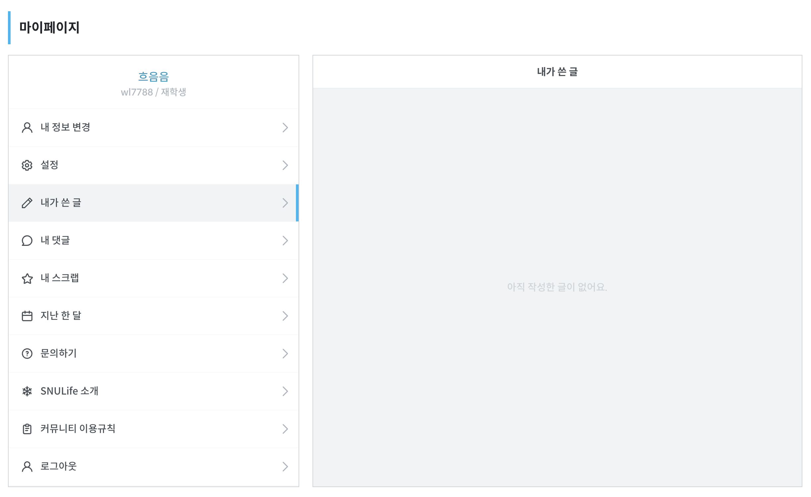

# ‘빈 공간’을 단순한 백지 상태 이상의 것으로 만들어라

처음 들어온 사용자는 아직 아무것도 만들지 않았다. 이때 **콘텐츠가 채워질 영역을 비워 둔 채로 보여주는 것**은 신규 사용자에게는 매우 형편없는 경험이며, 추가적인 오리엔테이션과 안내를 제공할 수 있는 절호의 기회를 놓치는 셈이다.

빈 공간을 유용한 텍스트, 힌트, 친절한 그래픽, 아이콘으로 구성할 수 있다. 이 페이지들은 기능별로 표시되기 때문에 **태스크 중심의 안내**를 제공하는 것이 어렵지 않다. 사용자가 할 일 목록을 본다면 첫 번째 할 일 항목을 만드는 방법을 안내할 수 있다. 프로필에서는 약력을 포함하거나 아바타 그림을 추가하는 식의 안내를 제공할 수 있다.

빈 공간은 한 차례만 보여지므로 사람들을 제품 기능이 익숙해지게 만들면서 동시에 ‘요령을 알고’ 싶어 하는 기존 사용자들은 더 효과적으로 사용법을 익히게 돕는 이상적인 방법이다. 그렇기 때문에 UX 디자이너는 사용자에게 유용한 빈 공간 제공을 반드시 고려해야 한다.

### 학습 포인트

- 빈 공간을 활용해서 신규 사용자를 적응시켜라.
- 사용자에게 태스크 중심의 안내를 제공하라.
- 기능별로 빈 공간을 제공한다면 구체적인 안내를 제공하라.

### 좋은 예시

[앱 화면의 빈 공간을 똑똑하게 디자인한 사례 21가지 | 요즘IT](https://yozm.wishket.com/magazine/detail/436/)

[Empty States](https://emptystat.es/)

### 적용할만한 사례

### 코멘트

- 수연: 디자이너가 미리 빈 화면, 에러 화면, 채워진 화면 등을 고민해보면 좋을 것 같다.
